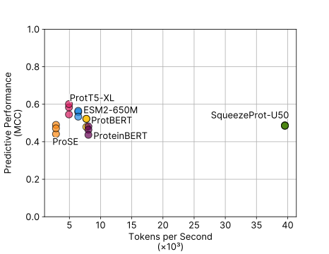

# Autofigures Demo

This document is a demonstration as to how to quickly regenerate all figures in the manuscript using the [`autofigures`](/autofigures/) programme. This demo was tested on a Debian-based Linux distribution, but should work on MacOS and Windows with the [Windows Subsytem for Linux](https://en.wikipedia.org/wiki/Windows_Subsystem_for_Linux).

## 0. Set-Up: Downloading code and data

The first step is to pull the code from GitHub

```bash
git clone https://github.com/Emad-COMBINE-lab/pllm-ppi-data-leakage.git
cd pllm-ppi-data-leakage
```

Next, after having to download the compressed data archive from [this mirror](https://drive.proton.me/urls/XP0QHQ51AM#d9HEKqgnvfEf). Note: the download is >16GiB, which will take some time to download.

```bash
cd data
# download the data.tar.zstd file here
tar -I zstd -xvf data.tar.zstd
```

## 1. Install dependencies

You can use `pip` or `poetry` to install dependencies, but I prefer uv.

Follow [these instructions](https://docs.astral.sh/uv/getting-started/installation/) to install `uv`. 

Next, update your local python environment by running

```bash
cd ../autofigures
uv sync
```

The figures use the [Inter font](https://rsms.me/inter/), so you'll have to install that as well if you want the figures to look like they do in the manuscript.

## 2. Generate all the figures.

Next, we can regenerate all the figures using

```bash
uv run python -m autofigures run_all
```

This should take less than 45 minutes, and result in the following files in the `out` directory:

```bash
total 34M
-rw-r--r--. 1 jszym jszym 313K Apr 17 23:10 acc_by_length.svg
-rw-r--r--. 1 jszym jszym  79K Apr 17 23:10 concordance.svg
-rw-r--r--. 1 jszym jszym  48K Apr 17 23:10 kw_k_ndcg.svg
-rw-r--r--. 1 jszym jszym 214K Apr 17 23:10 kw_ndcg_markers.svg
-rw-r--r--. 1 jszym jszym 432K Apr 17 23:10 length_heatmap_dscript.svg
-rw-r--r--. 1 jszym jszym 450K Apr 17 23:10 length_heatmap_esm.svg
-rw-r--r--. 1 jszym jszym 436K Apr 17 23:10 length_heatmap_intrepppid.svg
-rw-r--r--. 1 jszym jszym 423K Apr 17 23:10 length_heatmap_pipr.svg
-rw-r--r--. 1 jszym jszym 447K Apr 17 23:10 length_heatmap_prose.svg
-rw-r--r--. 1 jszym jszym 450K Apr 17 23:10 length_heatmap_proteinbert.svg
-rw-r--r--. 1 jszym jszym 451K Apr 17 23:10 length_heatmap_prottrans_bert.svg
-rw-r--r--. 1 jszym jszym 457K Apr 17 23:10 length_heatmap_prottrans_t5.svg
-rw-r--r--. 1 jszym jszym 435K Apr 17 23:10 length_heatmap_rapppid.svg
-rw-r--r--. 1 jszym jszym 400K Apr 17 23:10 length_heatmap_richoux.svg
-rw-r--r--. 1 jszym jszym  15K Apr 17 23:10 length_heatmap_sizes.svg
-rw-r--r--. 1 jszym jszym 450K Apr 17 23:10 length_heatmap_sprint.svg
-rw-r--r--. 1 jszym jszym 443K Apr 17 23:10 length_heatmap_squeezeprot_sp_nonstrict.svg
-rw-r--r--. 1 jszym jszym 444K Apr 17 23:10 length_heatmap_squeezeprot_sp_strict.svg
-rw-r--r--. 1 jszym jszym 444K Apr 17 23:10 length_heatmap_squeezeprot_u50.svg
-rw-r--r--. 1 jszym jszym 282K Apr 17 23:10 length_histogram.svg
-rw-r--r--. 1 jszym jszym 365K Apr 17 23:10 mutation_esm.png
-rw-r--r--. 1 jszym jszym 384K Apr 17 23:10 mutation_prose.png
-rw-r--r--. 1 jszym jszym 413K Apr 17 23:10 mutation_proteinbert.png
-rw-r--r--. 1 jszym jszym 378K Apr 17 23:10 mutation_prottrans_bert.png
-rw-r--r--. 1 jszym jszym 331K Apr 17 23:10 mutation_prottrans_t5.png
-rw-r--r--. 1 jszym jszym 423K Apr 17 23:10 mutation_squeezeprot_sp_nonstrict.png
-rw-r--r--. 1 jszym jszym 393K Apr 17 23:10 mutation_squeezeprot_sp_strict.png
-rw-r--r--. 1 jszym jszym 355K Apr 17 23:10 mutation_squeezeprot_u50.png
-rw-r--r--. 1 jszym jszym 142K Apr 17 23:10 mutation.svg
-rw-r--r--. 1 jszym jszym  22M Apr 17 23:10 sars_cov2_breakdown.svg
-rw-r--r--. 1 jszym jszym 1.6M Apr 17 23:10 sars_cov2_roc_highlight.svg
-rw-r--r--. 1 jszym jszym 960K Apr 17 23:10 sars_cov2_roc.svg
-rw-r--r--. 1 jszym jszym 107K Apr 17 23:10 speed.svg
-rw-r--r--. 1 jszym jszym  43K Apr 17 23:10 strict_nonstrict.svg
```

These files are all the panels (or components of the panels) in the figure.

For example, `speed.svg` corresponds to Fig. 1b in the manuscript and looks like:



## What next?

Check out the [autofigures](/autofigures) and [Experiments](/experiments) tabs above to geenerate individual figures or run individual experiments.